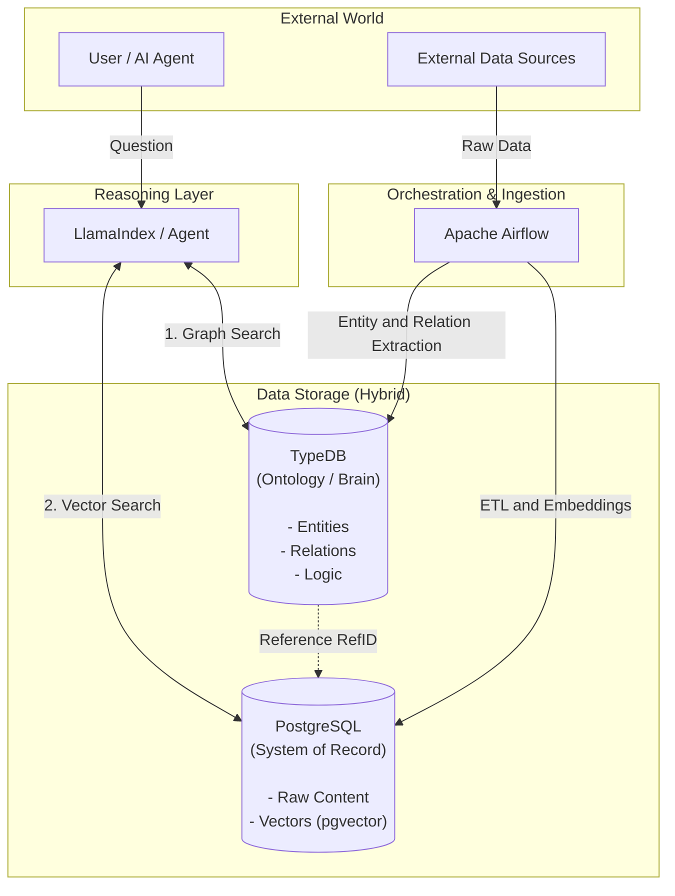

# Riemann Ontologic

**Riemann Ontologic**는 **Palantir Foundry**의 철학을 계승하여 구축된 **온톨로지 중심(Ontology-centric) 데이터 플랫폼**입니다. 

현대적인 AI 에이전트와 추론 시스템을 위해 **구조화된 지식(Graph)**과 **비정형 데이터(Vector/Content)**를 유기적으로 결합한 **하이브리드 아키텍처**를 채택했습니다.

---

## 🏗 아키텍처 (Hybrid Architecture)



이 프로젝트는 "데이터의 관계"와 "데이터의 내용"을 효율적으로 분리하여 관리합니다.

### 1. 🧠 The Brain: TypeDB (Ontology Layer)
*   **역활:** 데이터의 의미(Semantics)와 관계(Relations)를 저장하고 추론합니다.
*   **내용:** 사람(Person), 조직(Organization), 문서(Document) 등의 **엔티티(Entity)**와 그들 간의 **연결(Link)**.
*   **특징:** 무거운 텍스트 데이터는 저장하지 않고, `external-ref`를 통해 실제 데이터 위치만 참조합니다.

### 2. 📚 The Library: PostgreSQL + pgvector (System of Record)
*   **역할:** 원천 데이터(Source of Truth)와 벡터 임베딩을 저장합니다.
*   **내용:** 문서의 전체 본문(`content`), 요약(`summary`), 그리고 AI 검색을 위한 **Vector Embeddings**.
*   **연결:** TypeDB의 `external-ref`와 1:1로 매핑되는 `external_ref_id`를 가집니다.

### 3. 🤖 The Agent: LlamaIndex (Reasoning Layer)
*   **역할:** 자연어 질문을 이해하고, 그래프(TypeDB)와 벡터(Postgres)를 결합하여 답변을 생성합니다.
*   **방식:** "Alice가 쓴 문서" 같은 질문이 들어오면 그래프에서 관계를 찾고, 문서의 내용은 Postgres에서 가져와 LLM에게 전달합니다.

### 4. ⚙️ Orchestration: Apache Airflow
*   **역할:** 데이터 파이프라인 관리. 주기적으로 외부 데이터를 수집하여 Postgres와 TypeDB에 적재합니다.

---

## � 데이터 모델링 전략 (Modeling Strategy)

대규모 데이터(예: 재무회계 시스템의 수십만 건 전표)를 다룰 때의 핵심 전략입니다. **"모든 데이터를 TypeDB에 넣는 것이 아니라, '연결'이 중요한 데이터만 넣습니다."**

### Q. 전표가 수십만 건인데 TypeDB가 무거워지지 않나요?
**A. 걱정하지 마세요. TypeDB는 대용량 처리가 가능하지만, 효율성을 위해 아래와 같이 역할을 나눕니다.**

#### 1. ✅ TypeDB에 넣어야 할 것 (Master Data & Relations)
*   **목적:** 복잡한 그래프 탐색, 이상 징후 탐지, 관계 추적.
*   **대상:**
    *   **엔티티:** 거래처(Vendor), 임직원, 부서, 계정과목.
    *   **관계:** 지분 구조, 결재 라인, 계약 관계.
    *   **주요 트랜잭션:** 고액 거래, 신규 거래처와의 첫 거래 등 **"추적(Trace)"**이 필요한 중요 이벤트.

#### 2. ❌ PostgreSQL에 남겨둘 것 (Transactional Logs)
*   **목적:** 단순 집계(Sum, Avg), 이력 조회, 통계.
*   **대상:**
    *   단순 반복 전표 (예: 소액 법인카드 내역, 택시비 등).
    *   시스템 로그, 변경 이력.
    *   **단순 조회용** 데이터는 `external-ref`를 통해 필요할 때만 Postgres에서 원본을 가져옵니다.

> **결론:** "집계(얼마야?)"가 목적이면 Postgres, "추적(어떻게 흘러갔어?)"이 목적이면 TypeDB를 사용합니다.
###  심화 사례: 회계 규정(Regulation) 모델링
회계 기준서나 사규와 같이 **"해석과 적용"**이 필요한 문서 데이터의 처리 전략입니다.

#### 1. 📄 청킹(Chunking) 및 저장 전략 (Postgres)
*   규정 문서는 통짜로 저장하지 않고, **조항(Article)**이나 **항(Paragraph)** 단위로 쪼개어(Chunking) 저장합니다.
*   각 청크는 `embedding` 벡터를 생성하여 의미 기반 검색이 가능하게 합니다.

#### 2. 🔗 논리적 연결 (TypeDB)
*   **계층 구조:** `Regulation` → `Article` → `Clause` 형태의 포함 관계(`composition`)를 그래프로 표현합니다.
*   **적용 관계:** 특정 조항이 어떤 **계정과목(Account)**이나 **부서(Department)**에 영향을 미치는지 `governs` 또는 `applies-to` 관계를 맺습니다.

> **Effect:** 사용자가 "접대비 관련 규정 찾아줘"라고 물으면, 벡터 검색으로 관련 조항을 찾고, **"이 조항은 영업팀에만 적용됩니다"**라는 맥락(Context)까지 그래프에서 찾아낼 수 있습니다.
---

## �🛠 기술 스택 (Tech Stack)

| 구분 | 기술 | 설명 |
| :--- | :--- | :--- |
| **Ontology DB** | **TypeDB** | 추론 가능한 지식 그래프 엔진 |
| **Relational/Vector DB** | **PostgreSQL** (pg16) | `pgvector` 확장을 사용한 하이브리드 저장소 |
| **Framework** | **LlamaIndex** | RAG 및 에이전트 프레임워크 |
| **Orchestration** | **Apache Airflow** | 데이터 워크플로우 관리 |
| **Visualization** | **TypeDB Studio** | 온톨로지 시각화 및 탐색 도구 |
| **Infrastructure** | **Docker Compose** | 컨테이너 오케스트레이션 |

---

## 🚀 시작하기 (Quick Start)

### 1. 사전 요구사항 (Prerequisites)
*   **Docker Desktop** 또는 **Rancher Desktop** (dockerd 모드 권장)
*   Python 3.9 이상

### 2. 프로젝트 설정
```bash
# 가상환경 생성 및 진입
python3 -m venv .venv
source .venv/bin/activate

# 의존성 설치
pip install -r requirements.txt
```

### 3. 인프라 실행 (Docker)
Postgres, TypeDB, Airflow 컨테이너를 실행합니다.
```bash
docker-compose up -d
```
*   **Airflow UI:** [http://localhost:8080](http://localhost:8080) (ID/PW: `admin`/`admin`)
*   **TypeDB:** `localhost:1729` (TypeDB Studio 연결용)

### 4. 스키마 초기화 (Schema Initialization)
두 개의 데이터베이스 스키마를 각각 초기화합니다.

```bash
# 1. TypeDB 온톨로지 정의 (Entities & Relations)
python src/manage_ontology.py

# 2. PostgreSQL 테이블 및 pgvector 인덱스 생성
python src/init_postgres.py
```

### 5. 데이터 주입 (Data Seeding)
테스트를 위한 더미 데이터를 생성하여 양쪽 DB에 동시에 적재합니다.
```bash
python src/seed_data.py
```

### 6. 검증 및 에이전트 실행
데이터가 잘 연결되었는지 확인하고, AI 에이전트에게 질문을 던집니다.

```bash
# 데이터 적재 현황 및 연결 확인 리포트
python src/verify_data.py

# 하이브리드 쿼리 (TypeDB 검색 -> Postgres 조회) 데모
python src/demo_query.py

# LlamaIndex 기반 AI 에이전트 데모 (자연어 질문)
python src/inference/agent_demo.py
# 질문 예시: "Alice가 작성한 문서들에 대해 알려줘"
```

---

## 📂 프로젝트 구조

```
riemann-ontologic/
├── docker-compose.yml       # 인프라 구성 (TypeDB, Postgres, Airflow)
├── src/
│   ├── schema/
│   │   └── base_ontology.tql  # TypeDB 온톨로지 정의 파일 (TQL)
│   ├── inference/
│   │   ├── custom_retriever.py # LlamaIndex 커스텀 리트리버 (TypeDB+Postgres 연결)
│   │   └── agent_demo.py       # AI 에이전트 실행 데모
│   ├── manage_ontology.py    # TypeDB 스키마 로더
│   ├── init_postgres.py      # Postgres 테이블/벡터 초기화
│   ├── seed_data.py          # 더미 데이터 생성 및 주입 (Idempotent)
│   ├── clean_db.py           # 데이터베이스 초기화 및 데이터 삭제
│   └── verify_data.py        # 데이터 검증 스크립트
├── dags/                     # Airflow DAGs (추후 구현)
└── requirements.txt          # Python 의존성
```
