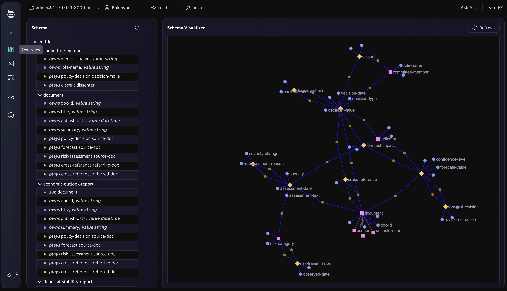
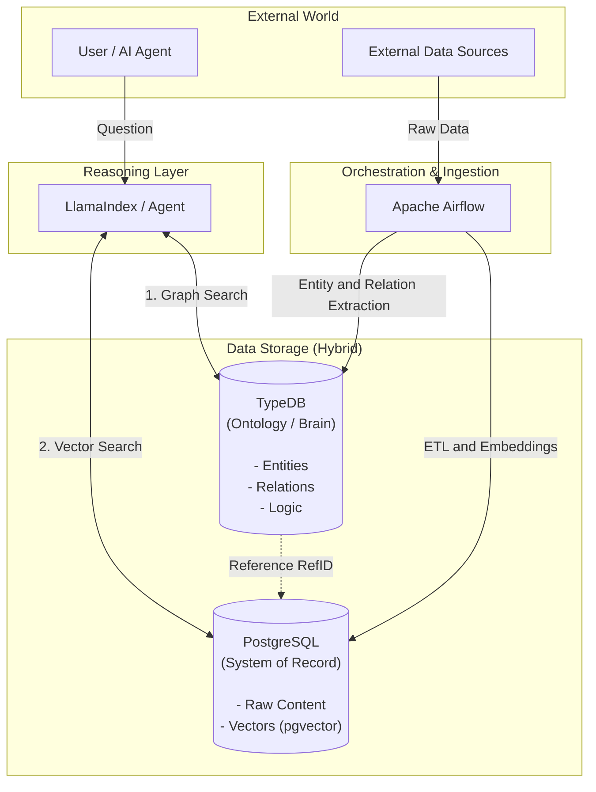

# Riemann Ontologic

**Riemann Ontologic**는 **Palantir Foundry**의 철학을 계승하여 구축된 **온톨로지 중심(Ontology-centric) 데이터 플랫폼**입니다. 

현대적인 AI 에이전트와 추론 시스템을 위해 **구조화된 지식(Graph)**과 **비정형 데이터(Vector/Content)**를 유기적으로 결합한 **하이브리드 아키텍처**를 채택했습니다.

---

## 📌 Bok-hyper: 중앙은행 통화정책 온톨로지

현재 구현된 핵심 모듈은 **Bok-hyper** — 중앙은행 금융통화위원회 의사결정 과정을 TypeDB 하이퍼릴레이션으로 모델링한 온톨로지입니다.

> ⚠️ **본 프로젝트의 모든 데이터(문서, 위원, 지표, 의사결정 등)는 가상의 시나리오로 구성되어 있으며, 실제 기관·인물·수치와 무관합니다.**

### Bok-hyper 스키마 그래프



### 핵심 개념: 하이퍼릴레이션

> **엔티티가 릴레이션(무대)에서 역할(배역)을 연기(play)한다.**
> **릴레이션도 또 다른 릴레이션(더 큰 무대)에서 배역을 연기할 수 있다.**

이것이 하이퍼릴레이션의 전부입니다.

```
이창용(엔티티) ──plays──▶ policy-decision(무대) as decision-maker(배역)
    └── 그 policy-decision(배우) ──plays──▶ decision-chain(더 큰 무대) as prior-decision(배역)
```

| 구분 | 기준 | 예시 |
| :--- | :--- | :--- |
| **일반 릴레이션** | role에 엔티티만 참여 | `policy-decision(doc, indicator, member)` |
| **하이퍼릴레이션** | role에 릴레이션이 참여 | `decision-chain(policy-decision, policy-decision)` |
| **N항 릴레이션** | role 개수가 3개 이상 | `cross-reference(doc, doc, decision)` — 항 수와 무관 |

### 스키마 구조

```
엔티티 (4종)
├── document (@abstract)
│   ├── monetary-policy-minutes    금통위 의사록 (5건)
│   ├── economic-outlook-report    경제전망보고서 (3건)
│   └── financial-stability-report 금융안정보고서 (2건)
├── indicator                      경제지표 (6건)
├── committee-member               금통위원 (6건)
└── risk-factor                    리스크 요인 (5건)

릴레이션 — 기본 (엔티티 간)
├── policy-decision       금리 결정 (5건) — 3항: doc × indicator × member
├── forecast              경제 전망 (6건) — 2항: doc × indicator
└── risk-assessment       리스크 평가 (5건) — 3항: doc × risk × indicator

릴레이션 — 하이퍼 (릴레이션 간)
├── decision-chain        결정 체인 (4건) — policy-decision → policy-decision
├── dissent               소수의견 (4건) — member × policy-decision
├── forecast-revision     전망 수정 (3건) — forecast → forecast
├── forecast-impact       정책→전망 영향 (1건) — policy-decision → forecast
├── risk-reassessment     리스크 재평가 (2건) — risk-assessment → risk-assessment
├── risk-transmission     리스크 전이 (2건) — risk-factor → risk-factor
└── cross-reference       문서 교차참조 (2건) — doc × doc × policy-decision
```

### 스키마 설계 포인트

| 설계 요소 | 적용 방식 |
| :--- | :--- |
| **`@abstract` 상속** | `document`는 추상 엔티티 — 직접 인스턴스 불가, 3개 서브타입으로만 생성 |
| **`@key` 자연키** | `doc-id`, `indicator-name`, `member-name`, `risk-name`으로 중복 방지 |
| **`plays` 타입 안전** | 컴파일 타임 인터페이스 — `risk-factor`를 `decision-maker`에 넣으면 거부 |
| **`relates` 역할 슬롯** | 데이터 삽입 시 엔티티의 IID(내부 포인터)가 바인딩됨 |
| **시간축 내장** | 대부분의 릴레이션에 날짜 속성 포함 → 이력 추적 가능 |

### 검증 시나리오 (15개)

| # | 시나리오 | 기대건수 | 난이도 |
| :--- | :--- | :--- | :--- |
| 1 | 기준금리 결정 이력 조회 | 5건 | 기본 |
| 2 | 동결→인하 기조 전환점 탐지 | 1건 | 하이퍼 |
| 3 | 소수의견 전체 조회 | 4건 | 하이퍼 |
| 4 | 서영경 위원 소수의견 이력 | 2건 | 하이퍼 |
| 5 | GDP 전망 수정 이력 | 2건 | 하이퍼 |
| 6 | 2024.10 인하가 전망에 미친 영향 | 1건 | 하이퍼 |
| 7 | 리스크 등급 상향 추적 | 2건 | 2차 하이퍼 |
| 8 | 가계부채 리스크 전이 경로 (2-hop) | 1+1건 | 그래프 탐색 |
| 9 | 교차참조 네트워크 | 2건 | 3항 하이퍼 |
| 10 | 전체 결정 체인 순회 | 4건 | 하이퍼 |
| 11 | FSR-2024-12 리스크 대시보드 | 3건 | 기본 |
| 12 | 전망보고서별 GDP/물가 비교 | 6건 | 기본 |
| 13 | 소비자물가 전망 수정 | 1건 | 하이퍼 |
| 14 | 가계부채 전체 컨텍스트 (A+B+C) | 2+1+1건 | 종합 |
| 15 | 10월 인하 360도 분석 (A+B+C+D) | 1+1+1+2건 | 종합 |

---

## 🏗 아키텍처 (Hybrid Architecture)



이 프로젝트는 "데이터의 관계"와 "데이터의 내용"을 효율적으로 분리하여 관리합니다.

### 1. 🧠 The Brain: TypeDB (Ontology Layer)
*   **역할:** 데이터의 의미(Semantics)와 관계(Relations)를 저장하고 추론합니다.
*   **내용:** 사람(Person), 조직(Organization), 문서(Document) 등의 **엔티티(Entity)**와 그들 간의 **연결(Link)**.
*   **특징:** 무거운 텍스트 데이터는 저장하지 않고, `external-ref`를 통해 실제 데이터 위치만 참조합니다.

### 2. 📚 The Library: PostgreSQL + pgvector (System of Record)
*   **역할:** 원천 데이터(Source of Truth)와 벡터 임베딩을 저장합니다.
*   **내용:** 문서의 전체 본문(`content`), 요약(`summary`), 그리고 AI 검색을 위한 **Vector Embeddings**.
*   **연결:** TypeDB의 `external-ref`와 1:1로 매핑되는 `external_ref_id`를 가집니다.

### 3. 🤖 The Agent: LlamaIndex (Reasoning Layer)
*   **역할:** 자연어 질문을 이해하고, 그래프(TypeDB)와 벡터(Postgres)를 결합하여 답변을 생성합니다.
*   **방식:** "Alice가 쓴 문서" 같은 질문이 들어오면 그래프에서 관계를 찾고, 문서의 내용은 Postgres에서 가져와 LLM에게 전달합니다.

### 4. ⚙️ Orchestration: Apache Airflow
*   **역할:** 데이터 파이프라인 관리. 주기적으로 외부 데이터를 수집하여 Postgres와 TypeDB에 적재합니다.

---

## � 데이터 모델링 전략 (Modeling Strategy)

대규모 데이터(예: 재무회계 시스템의 수십만 건 전표)를 다룰 때의 핵심 전략입니다. **"모든 데이터를 TypeDB에 넣는 것이 아니라, '연결'이 중요한 데이터만 넣습니다."**

### Q. 전표가 수십만 건인데 TypeDB가 무거워지지 않나요?
**A. 걱정하지 마세요. TypeDB는 대용량 처리가 가능하지만, 효율성을 위해 아래와 같이 역할을 나눕니다.**

#### 1. ✅ TypeDB에 넣어야 할 것 (Master Data & Relations)
*   **목적:** 복잡한 그래프 탐색, 이상 징후 탐지, 관계 추적.
*   **대상:**
    *   **엔티티:** 거래처(Vendor), 임직원, 부서, 계정과목.
    *   **관계:** 지분 구조, 결재 라인, 계약 관계.
    *   **주요 트랜잭션:** 고액 거래, 신규 거래처와의 첫 거래 등 **"추적(Trace)"**이 필요한 중요 이벤트.

#### 2. ❌ PostgreSQL에 남겨둘 것 (Transactional Logs)
*   **목적:** 단순 집계(Sum, Avg), 이력 조회, 통계.
*   **대상:**
    *   단순 반복 전표 (예: 소액 법인카드 내역, 택시비 등).
    *   시스템 로그, 변경 이력.
    *   **단순 조회용** 데이터는 `external-ref`를 통해 필요할 때만 Postgres에서 원본을 가져옵니다.

> **결론:** "집계(얼마야?)"가 목적이면 Postgres, "추적(어떻게 흘러갔어?)"이 목적이면 TypeDB를 사용합니다.
###  심화 사례: 회계 규정(Regulation) 모델링
회계 기준서나 사규와 같이 **"해석과 적용"**이 필요한 문서 데이터의 처리 전략입니다.

#### 1. 📄 청킹(Chunking) 및 저장 전략 (Postgres)
*   규정 문서는 통짜로 저장하지 않고, **조항(Article)**이나 **항(Paragraph)** 단위로 쪼개어(Chunking) 저장합니다.
*   각 청크는 `embedding` 벡터를 생성하여 의미 기반 검색이 가능하게 합니다.

#### 2. 🔗 논리적 연결 (TypeDB)
*   **계층 구조:** `Regulation` → `Article` → `Clause` 형태의 포함 관계(`composition`)를 그래프로 표현합니다.
*   **적용 관계:** 특정 조항이 어떤 **계정과목(Account)**이나 **부서(Department)**에 영향을 미치는지 `governs` 또는 `applies-to` 관계를 맺습니다.

> **Effect:** 사용자가 "접대비 관련 규정 찾아줘"라고 물으면, 벡터 검색으로 관련 조항을 찾고, **"이 조항은 영업팀에만 적용됩니다"**라는 맥락(Context)까지 그래프에서 찾아낼 수 있습니다.
---

## �🛠 기술 스택 (Tech Stack)

| 구분 | 기술 | 설명 |
| :--- | :--- | :--- |
| **Ontology DB** | **TypeDB** | 추론 가능한 지식 그래프 엔진 |
| **Relational/Vector DB** | **PostgreSQL** (pg16) | `pgvector` 확장을 사용한 하이브리드 저장소 |
| **Framework** | **LlamaIndex** | RAG 및 에이전트 프레임워크 |
| **Orchestration** | **Apache Airflow** | 데이터 워크플로우 관리 |
| **Visualization** | **TypeDB Studio** | 온톨로지 시각화 및 탐색 도구 |
| **Infrastructure** | **Docker Compose** | 컨테이너 오케스트레이션 |

---

## 🚀 시작하기 (Quick Start)

### 1. 사전 요구사항 (Prerequisites)
*   **Docker Desktop** 또는 **Rancher Desktop** (dockerd/moby 모드)
*   Python 3.9 이상

### 2. 프로젝트 설정
```bash
# 가상환경 생성 및 진입
python3 -m venv .venv
source .venv/bin/activate

# 의존성 설치
pip install -r requirements.txt
```

### 3. 인프라 실행 (Docker)
```bash
# TypeDB 단독 실행
docker compose up -d typedb

# 전체 스택 (Postgres + TypeDB + Airflow)
docker compose up -d
```
*   **TypeDB:** `localhost:1729` (TypeDB Studio 연결)
*   **TypeDB HTTP:** `localhost:8000`
*   **Airflow UI:** [http://localhost:8080](http://localhost:8080) (ID/PW: `admin`/`admin`)

> **⚠️ 데이터 영속성:** TypeDB 데이터는 `./data/typedb/`에 호스트 바인드 마운트로 저장됩니다.  
> Docker가 재시작되거나 factory reset되어도 데이터가 유지됩니다.

### 4. Bok-hyper DB 복구 (스키마 + 데이터 일괄 적재)
```bash
# 한 번에 DB 생성 → 스키마 → 엔티티 → 릴레이션 → 하이퍼릴레이션 적재
python restore_db.py
```

적재 순서: `bok_schema.tql` → `bok_insert_part1_entities.tql` → `bok_insert_part2_relations.tql` → `bok_insert_part3_hyper_relations.tql`

### 5. 전체 시나리오 검증
```bash
# 15개 시나리오 자동 검증 (모두 PASS 확인)
python verify_all_scenarios.py
```

### 6. 수동 TQL 적재 (참고)
```bash
# 개별 파일을 TypeDB Console로 직접 실행할 경우
typedb console --command="transaction Bok-hyper schema write" < src/schema/bok_schema.tql
typedb console --command="transaction Bok-hyper data write"   < src/schema/bok_insert_part1_entities.tql
typedb console --command="transaction Bok-hyper data write"   < src/schema/bok_insert_part2_relations.tql
typedb console --command="transaction Bok-hyper data write"   < src/schema/bok_insert_part3_hyper_relations.tql
```

---

## 📂 프로젝트 구조

```
riemann-ontologic/
├── docker-compose.yml            # 인프라 (TypeDB, Postgres, Airflow)
├── requirements.txt              # Python 의존성
├── restore_db.py                 # Bok-hyper DB 일괄 복구 스크립트
├── verify_all_scenarios.py       # 15개 시나리오 자동 검증
├── data/
│   └── typedb/                   # TypeDB 데이터 (호스트 바인드 마운트)
│       └── Bok-hyper/            # DB 파일 (Docker 외부 영속)
├── src/
│   ├── schema/
│   │   ├── bok_schema.tql                     # TypeDB 스키마 정의 (TypeDB 3.x)
│   │   ├── bok_insert_part1_entities.tql      # 엔티티 삽입 (27건)
│   │   ├── bok_insert_part2_relations.tql     # 기본 릴레이션 삽입 (16건)
│   │   ├── bok_insert_part3_hyper_relations.tql # 하이퍼릴레이션 삽입 (18건)
│   │   └── bok_typedb_query_scenarios_v2.md   # 15개 시나리오 쿼리 문서
│   ├── inference/
│   │   ├── custom_retriever.py   # LlamaIndex 커스텀 리트리버
│   │   ├── agent_demo.py         # AI 에이전트 데모
│   │   └── simple_query.py       # 단순 쿼리 예제
│   ├── manage_ontology.py        # TypeDB 스키마 로더
│   ├── init_postgres.py          # Postgres 테이블/벡터 초기화
│   ├── seed_data.py              # 더미 데이터 생성
│   ├── demo_query.py             # 하이브리드 쿼리 데모
│   ├── verify_data.py            # 데이터 검증
│   └── clean_db.py               # DB 초기화
├── dags/                         # Airflow DAGs
├── dbt/                          # dbt 변환 모델
└── tests/                        # 테스트
```

---

## 🔧 운영 참고사항

### TypeDB 접속 확인
```bash
# 포트 확인
nc -z -w 2 localhost 1729 && echo "OPEN" || echo "CLOSED"

# Python 드라이버 접속
python -c "
from typedb.driver import TypeDB, Credentials, DriverOptions
d = TypeDB.driver('http://localhost:1729', Credentials('admin','password'), DriverOptions(False, None))
print([db.name for db in d.databases.all()])
d.close()
"
```

### Docker 장애 복구
Rancher Desktop factory reset 등으로 Docker volume이 삭제된 경우:
```bash
# 1. TypeDB 컨테이너 재시작
docker compose up -d typedb

# 2. DB 복구 (호스트 바인드 마운트이므로 데이터가 남아있으면 별도 복구 불필요)
#    만약 data/typedb/가 비어있다면:
python restore_db.py

# 3. 검증
python verify_all_scenarios.py
```

### TypeDB 3.x 호환성 참고
| TypeDB 2.x | TypeDB 3.x | 비고 |
| :--- | :--- | :--- |
| `value long` | `value integer` | 스키마에서 정수 타입 변경 |
| `TransactionType.SCHEMA_WRITE` | `TransactionType.SCHEMA` | Python 드라이버 enum |
| `TransactionType.DATA_WRITE` | `TransactionType.WRITE` | Python 드라이버 enum |
